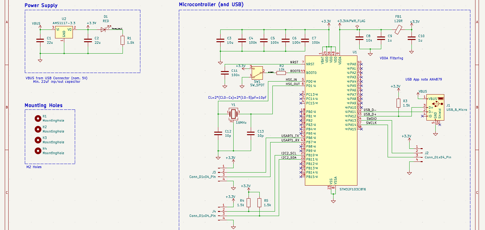
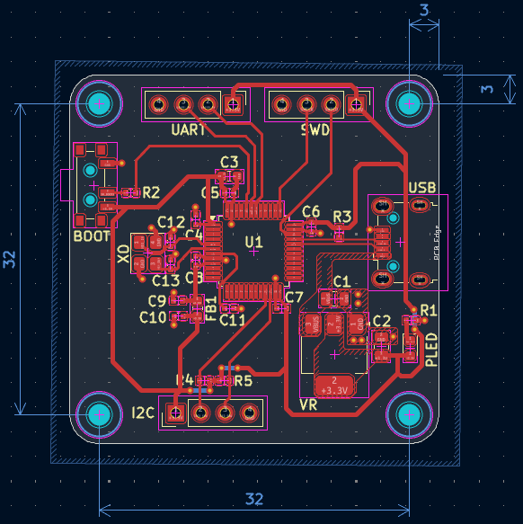
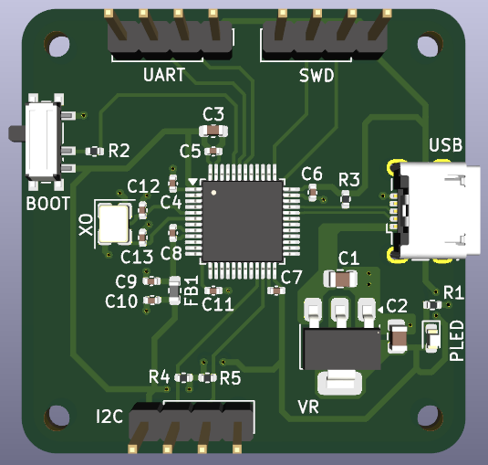
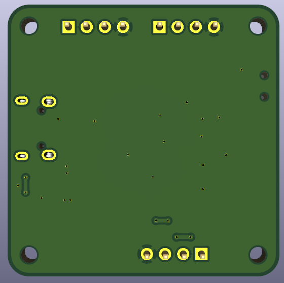

# STM32 Learning Project

A first PCB design project - an STM32F103C8T6 development board with USB, designed in KiCad while following Phil's Lab's PCB design course: <https://www.youtube.com/watch?v=aVUqaB0IMh4>

Guided by Phil's Lab's course - schematic and initial routing approach based on his walkthrough, with some layout and footprint adjustments made independently.

## Specs

- **MCU:** STM32F103C8T6
- **Power:** USB (5V), 3.3V via AMS1117-3.3 regulator
- **Interfaces:** USB (Micro-B), UART, SWD, I2C
- **Layers:** 2-layer, 1oz copper
- **Board size:** 32 x 32mm, 3mm corner radius
- **Status:** DRC-clean, manufacturing files generated (Gerbers, BOM, CPL)

## PCB Design

### Schematic

### PCB Layout

### 3D Renders

  
  

